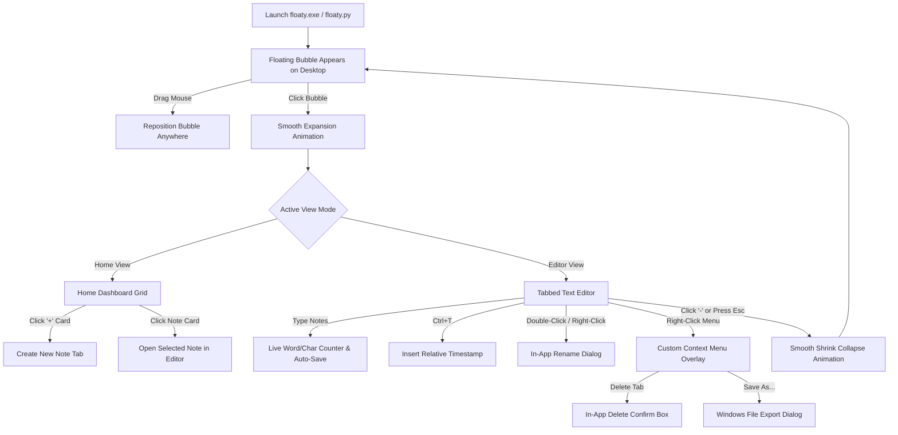
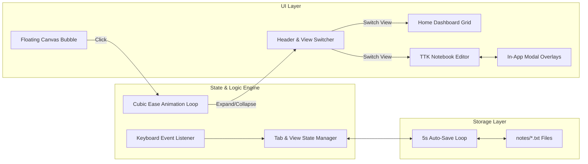

# ✦ Floaty - Comprehensive Development & Architecture Notes

This document details the creation process, architectural design, requirements, execution mechanics, and user workflow of **Floaty**.

---

## 📚 Table of Contents

1. [How Floaty Was Created](#1-how-floaty-was-created)
2. [Key Architecture Challenges & Technical Solutions](#2-key-architecture-challenges--technical-solutions)
3. [System Requirements](#3-system-requirements)
4. [User Flow Diagram](#4-user-flow-diagram)
5. [System Architecture Diagram](#5-system-architecture-diagram)
6. [Core Component Breakdown](#6-core-component-breakdown)
7. [Building & Deployment (.exe)](#7-building--deployment-exe)

---

## 1. How Floaty Was Created

Floaty evolved through several design and technical iterations to solve the problem of quick desktop note-taking without interrupting full-screen workflows:

### Phase 1: Prototype Floating Widget
- Started with a minimal Python `tkinter` script creating an always-on-top round canvas widget (`BUBBLE = 68px`).
- Utilized Windows color key transparency (`-transparentcolor`) and window frame removal (`root.overrideredirect(True)`) to make the bubble float seamlessly over all Windows applications.

### Phase 2: Multi-Tab Storage & Local Files
- Integrated `ttk.Notebook` to support tabbed editing for lecture notes, code snippets, and todo lists.
- Linked every tab directly to an individual `.txt` file inside a local `notes/` directory created automatically alongside the app.
- Added 5-second background autosaving and startup file restoration.

### Phase 3: Easing Animations & Visual Redesign
- Implemented step-by-step smooth geometry expansion (`animate_geometry`) powered by a cubic ease-out mathematical curve (`ease = 1 - (1 - t)^3`).
- Redesigned the visual theme to a dark glassmorphic palette (`#0f172a` obsidian background, `#1e293b` slate headers, `#8b5cf6` electric purple accents).

### Phase 4: Fixing Windows OS Z-Order Bugs (In-App Overlays)
- **Problem**: Native Tkinter `tk.Menu` popups and `Toplevel` dialogs were getting hidden or destroyed by Windows OS window z-ordering due to `-topmost` flag re-assertions.
- **Solution**: Converted all popup menus, rename dialogs, and delete confirmation boxes into **In-App Frame Overlays** (`place()` inside `panel`). Since they are drawn directly inside the single app window container, they are 100% immune to OS focus loss or window disappearance bugs.

### Phase 5: Home Screen Dashboard Grid
- Created a dual-view system (`current_view`: `"home"` vs `"editor"`).
- Added a Home Screen grid featuring note thumbnail cards (showing live snippets, titles, and word counts) alongside a prominent **New Notebook Note (`+`)** card.

---

## 2. Key Architecture Challenges & Technical Solutions

| Problem | Root Cause | Solution |
| :--- | :--- | :--- |
| **Window Frame Removal** | Standard window borders obstruct minimalist desktop bubbles. | `root.overrideredirect(True)` disables default titlebars. |
| **Bubble Transparency** | Canvas backgrounds show square borders on Windows. | `root.attributes("-transparentcolor", "#010101")` keys out background color. |
| **Popup Menu Disappearance** | Native OS menus lose z-index focus on topmost overrideredirect windows. | Implemented custom in-app `Frame` dropdown menu overlay (`custom_menu`). |
| **Dialog Disappearance** | Native `Toplevel` modal dialogs fall behind `-topmost` parent on mouse hover. | Built centered in-app modal overlay frames (`rename_overlay` & `delete_overlay`). |
| **Smooth Open/Close** | Abrupt window geometry changes feel jarring. | Step-by-step 14ms cubic ease interpolation using `root.after()`. |

---

## 3. System Requirements

- **Operating System**: Windows 10 / Windows 11 (Supports transparent color keys and `-topmost` window flags).
- **Python Version**: Python 3.8 or higher.
- **Dependencies**: 100% built with Python Standard Library (`tkinter`, `pathlib`, `re`, `time`, `math`). No third-party packages required for running.
- **Packaging (Optional)**: `pyinstaller` for generating standalone `floaty.exe`.

---

## 4. User Flow Diagram



---

## 5. System Architecture Diagram



---

## 6. Core Component Breakdown

### A. Animation Engine (`animate_geometry`)
Smooth easing geometry transition calculation:
$$\text{ease}(t) = 1 - (1 - t)^3$$
```python
def animate_geometry(start_w, start_h, target_w, target_h, start_x, start_y, target_x, target_y, steps=14, current_step=0, on_complete=None):
    if current_step > steps:
        root.geometry(f"{target_w}x{target_h}+{target_x}+{target_y}")
        if on_complete: on_complete()
        return
    progress = current_step / steps
    ease = 1 - math.pow(1 - progress, 3)
    cur_w = int(start_w + (target_w - start_w) * ease)
    cur_h = int(start_h + (target_h - start_h) * ease)
    root.geometry(f"{cur_w}x{cur_h}+{start_x}+{start_y}")
    root.after(14, lambda: animate_geometry(...))
```

### B. In-App Overlay System
Avoids OS z-order modal popup bugs by placing frames inside `panel`:
```python
rename_overlay = tk.Frame(panel, bg="#0f172a", highlightthickness=1.5, highlightbackground=ACCENT)
rename_overlay.place(relx=0.5, rely=0.45, anchor="center", width=340, height=135)
rename_overlay.lift()
```

---

## 7. Building & Deployment (.exe)

Floaty is packaged into a single standalone executable using `PyInstaller`:

```powershell
python -m PyInstaller --onefile --noconsole floaty.py
```

### Output Executable:
`dist/floaty.exe` (Single standalone binary containing embedded Python runtime & Tkinter assets).
